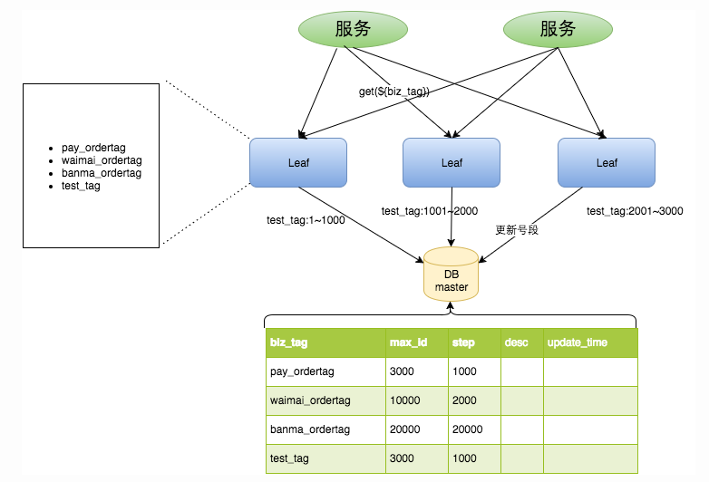

## Leaf
解析美团的分布式id框架Leaf-MySQL版本

## Introduction
### 数据库自增ID存在固有的弊端：
* 导入旧数据，可能会ID重复，导致导入失败
* 分布式架构中，多个MySQL实例可能会ID重复   

### Leaf秉承的四个特性：
1.全局唯一，绝对不会出现重复的ID，且ID整体趋势递增。  
2.高可用，服务完全基于分布式架构，即使MySQL宕机，也能容忍一段时间的数据库不可用。  
3.高并发低延时，在CentOS 4C8G的虚拟机上，远程调用QPS可达5W+，TP99在1ms内。  
4.接入简单，直接通过公司RPC服务或者HTTP调用即可接入。 

### 服务处理流程

* Leaf Server 1：从DB加载号段[1，1000]
* Leaf Server 2：从DB加载号段[1001，2000]
* Leaf Server 3：从DB加载号段[2001，3000]  


用户通过Round-robin的方式调用Leaf Server的各个服务，所以某一个Client获取到的ID序列可能是：1，1001，2001，2，1002，2002……  
也可能是：1，2，1001，2001，2002，2003，3，4……当某个Leaf Server号段用完之后，下一次请求就会从DB中加载新的号段，这样保证了每次加载的号段是递增的。  

Leaf数据库中的号段表格式如下：
```sql
CREATE DATABASE leaf
CREATE TABLE `leaf_alloc` (
  `biz_tag` varchar(128)  NOT NULL DEFAULT '',
  `max_id` bigint(20) NOT NULL DEFAULT '1',
  `step` int(11) NOT NULL,
  `description` varchar(256)  DEFAULT NULL,
  `update_time` timestamp NOT NULL DEFAULT CURRENT_TIMESTAMP ON UPDATE CURRENT_TIMESTAMP,
  PRIMARY KEY (`biz_tag`)
) ENGINE=InnoDB;
```

Leaf Server加载号段的SQL语句如下：

```sql
Begin
UPDATE table SET max_id=max_id+step WHERE biz_tag=xxx
SELECT tag, max_id, step FROM table WHERE biz_tag=xxx
Commit
```
最巧妙的点，用了数据库事务的原子性保证了线程安全。

 